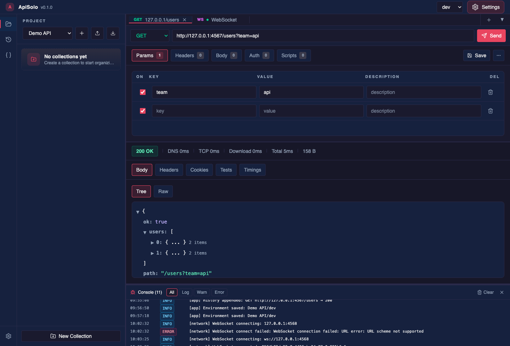
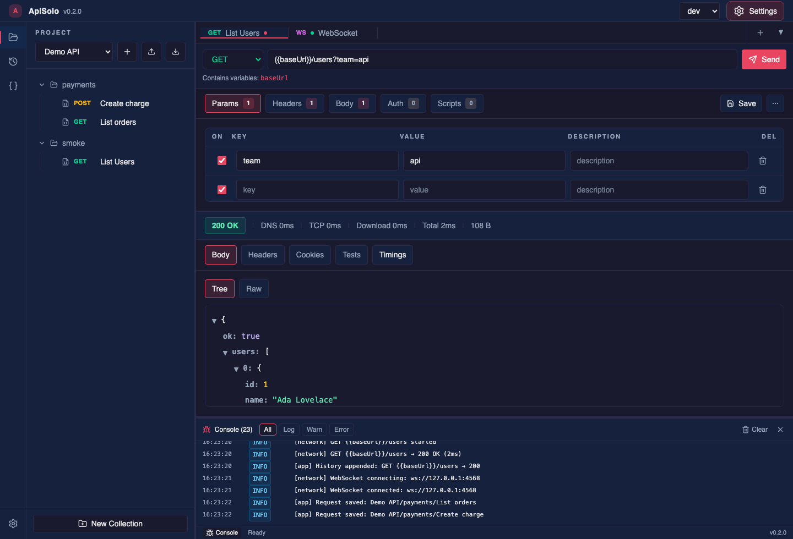
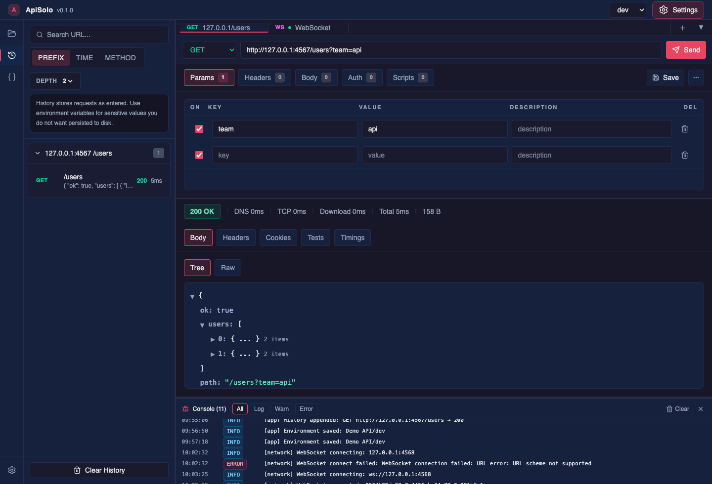
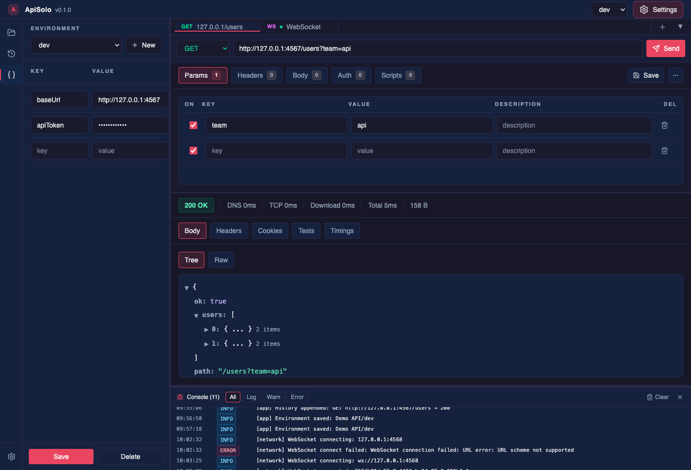
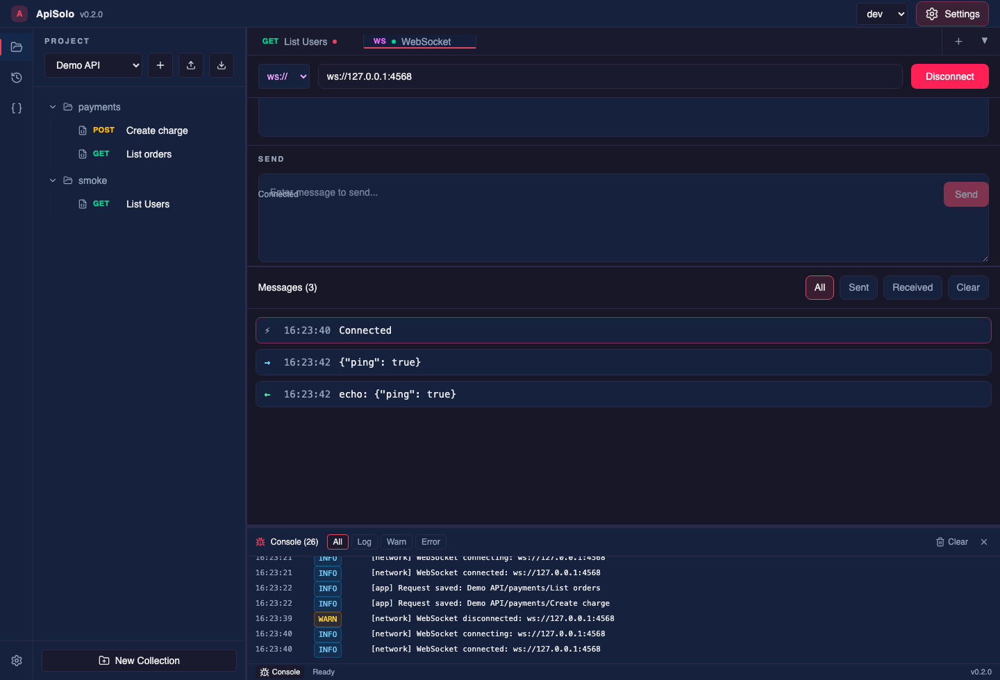
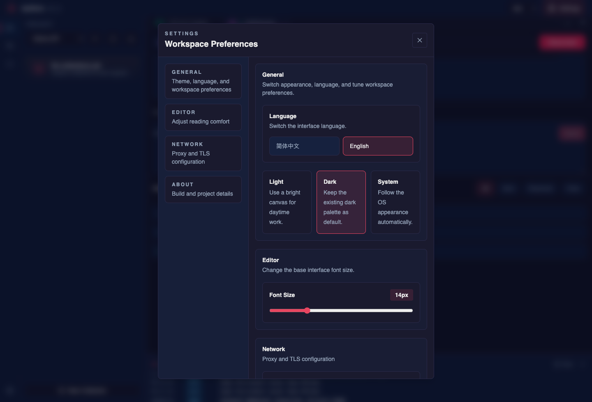
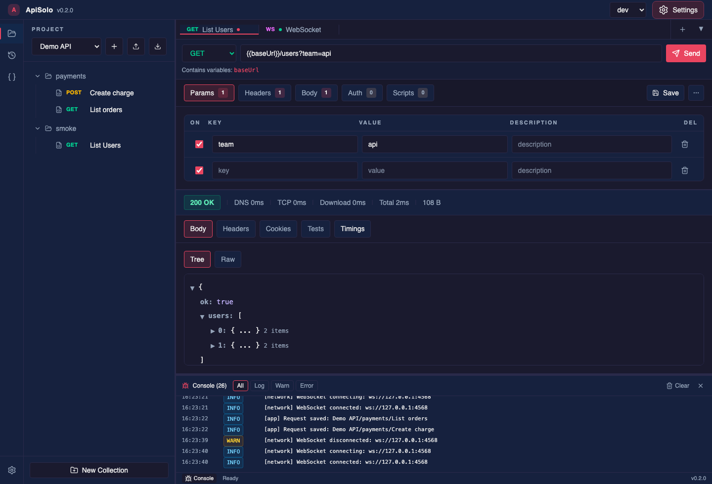

# ApiSolo

ApiSolo is a local-first desktop API client built with Tauri, Rust, Vue, and Pinia. It focuses on HTTP request authoring, WebSocket debugging, project collections, environment variables, request history, and a built-in console without requiring a hosted account.

[简体中文](./README.zh-CN.md)

## Screenshots

| HTTP workspace | JSON response tree |
| --- | --- |
|  |  |

| Collections and import/export | History grouping |
| --- | --- |
|  |  |

| Environments and secrets | WebSocket workspace |
| --- | --- |
|  |  |

| Settings | Debug console |
| --- | --- |
|  |  |

## Features

- HTTP request builder with methods, URL params, headers, body modes, auth helpers, and response timing.
- JSON tree and raw response views, response headers, cookies, tests, and timing details.
- Project collections with request save/load plus Postman-compatible import/export paths.
- Environment variables with normal values plus user-selected secret storage: a local encrypted vault by default, or the operating system keychain if explicitly selected.
- Pre-request and test scripts executed in a QuickJS WebAssembly sandbox with timeouts.
- WebSocket connections with handshake headers, sent/received message history, and connection state.
- Request history grouped by URL prefix, time, or method, with replay-friendly saved entries.
- Built-in debug console for app, network, and script events.
- Light/dark/system themes, English and Simplified Chinese UI, proxy, and TLS settings.

## Interface Tour

- Left rail: switch between Collections, History, and Environments.
- Header: select the active environment and open Settings.
- Tab bar: keep multiple HTTP and WebSocket tabs open; use More to create protocol-specific tabs.
- Request panel: edit URL, params, headers, body, auth, and scripts before sending.
- Response panel: inspect status, timing, body, headers, cookies, tests, and timing breakdowns.
- Footer console: review request lifecycle, script output, warnings, and errors.

## Core Workflows

1. Create or select a project from Collections.
2. Add an HTTP tab, enter a URL, configure params/headers/body/auth, and send it.
3. Save useful requests into collections and export them when needed.
4. Create an environment, store stable values as normal variables, and mark tokens/passwords as secrets.
5. Use placeholders such as `{{baseUrl}}` or `{{apiToken}}` in requests instead of hard-coded sensitive values.
6. Use WebSocket tabs for local or remote socket debugging.
7. Check History for previous calls and replay entries when needed.

## Security and Privacy Model

ApiSolo stores data locally. It does not require a cloud account.

- Data directory: `$HOME/ApiSolo`.
- Projects: `$HOME/ApiSolo/projects/<project-slug>/`.
- History file: `$HOME/ApiSolo/scratch/history.jsonl`.
- Window state: `$HOME/ApiSolo/scratch/window-state.json` stores the last main-window size so ApiSolo reopens at the user-adjusted dimensions.
- Normal environment variables: project `.env.json` files.
- Secret environment variables: on first launch ApiSolo asks how to store secrets. The default is a local encrypted vault at `$HOME/ApiSolo/scratch/secrets.vault.json`; the master password is kept in memory only and must be entered after app restart. The optional system keychain mode uses Rust `keyring` under the `ApiSolo` service and may trigger OS permission prompts.
- Secret storage config: `$HOME/ApiSolo/scratch/secret-storage.json` stores only the chosen backend, not secret values or the local vault password.
- Secret metadata: `.env.secrets.json` stores names and vault references only; secret values are written as empty strings.
- Migration: if an older `.env.secrets.json` contains plaintext secret values, ApiSolo imports them into the selected secret backend on first load and rewrites the metadata file without plaintext.
- Quarantined history lines: `$HOME/ApiSolo/scratch/history.corrupt.jsonl` holds lines that could not be parsed, byte for byte, so a single damaged line costs only itself instead of blanking the whole panel. Clearing history deletes this file along with `history.jsonl`; that is not undoable.
- Vault maintenance: `$HOME/ApiSolo/scratch/vault-maintenance.json` records identifier collisions found during migration and the vault entries still queued for deletion. It stores identifiers and a failure category only — never a secret value, and never the raw error text from a keychain or vault backend.
- Secret identifiers: a vault key is `<project>:<environment>:<base64url variable name>`, and non-ASCII project and environment names are kept as written rather than folded into underscores, so `生产` and `测试` no longer share one slot.
- Lazy migration: entries stored under the older identifier scheme are moved the next time you open that environment, not in a batch on startup. Until an environment is opened it keeps working off its old entry.
- Crash leftovers: an interrupted write can leave a hidden `.<name>.<uuid>.tmp` file next to the target. Nothing reads these and nothing cleans them up automatically; delete them yourself whenever you like.
- Unreadable secret metadata: a `.env.secrets.json` that cannot be parsed is renamed to `<name>.env.secrets.corrupt-<timestamp>.json` with its bytes untouched, rather than being overwritten or deleted. This applies both when you save the environment and when you delete it — those bytes are the only record of which vault entries it owned. If that name is already taken, a counter is appended rather than replacing the earlier copy. ApiSolo never reads the renamed file again, and it is not repaired for you: recovery means editing the quarantined copy until it is valid JSON and only then renaming it back. Renaming an unrepaired copy back reproduces the original failure — opening that environment fails loudly again, and the next save sets the same file aside once more.
- An API key configured under Auth with **Add to: Query** is appended to the query string only when the request is sent; it is deliberately not shown in the URL bar, so the key never appears in an address you might copy or screenshot. An empty-looking address bar here means the key is hidden, not missing.
- Saved requests and history keep variable placeholders such as `{{token}}`, but redact direct auth/header secret values and strip `fileContent` / `binaryContent` bytes before persistence.
- Redaction is driven by the field name only; credentials written under a non-sensitive field name — including the value of an ordinary header or param — are neither redacted nor marked, and are stored as-is.
- A request opened from history has its redacted values restored as empty, marked fields. They must be re-entered before the request will succeed; the placeholder `[redacted]` is never sent on the wire.
- Request scripts still read plaintext secret values through `pm.environment.get`. Only a whole-value copy into a new variable inherits the secret marker; derived copies such as `token.slice(0, 10)` do not.
- After upgrading, `signature` / `credential` / `subscription-key` style fields in existing collection requests are shown empty and need re-entering. The file on disk is untouched until you save that request.
- A redacted non-string JSON value (number, boolean, null, object, array) comes back as an empty string `""` when replayed from history; its type changes.
- File uploads selected in the UI are session data; saved and historical entries keep only sanitized labels/placeholders.
- Proxy authentication passwords are not persisted to browser local storage.
- Pre-request scripts abort the request on failure and report the error in the active tab and console.
- Script runtime: request scripts run in QuickJS/WASM with a limited API surface (`pm`, `console`, assertions, timeout, and variable updates). Host globals such as `window`, Node APIs, and Tauri APIs are not exposed.

Security-sensitive settings:

- Disabling TLS certificate verification is only for trusted local debugging; it allows man-in-the-middle interception.
- Proxy settings route traffic through the configured proxy and may expose request metadata and bodies to that proxy.
- Imported collections can contain untrusted data. Review scripts before enabling them.

## Development

Prerequisites:

- Node.js 22+
- Rust 1.88+ stable
- Platform dependencies required by Tauri 2

Commands:

```bash
npm install
npm run dev
npm run dev:web
npm run dev:web:client
npm run dev:web:api
```

Development modes:

- `npm run dev` starts the full Tauri app with `devtools` and `dev-bridge` features.
- `npm run dev:web` starts Vite plus the Rust development bridge for browser-based UI testing.
- `npm run dev:web:api` starts only the Rust development bridge.
- The development bridge is compiled only with the `dev-bridge` feature and requires a per-session token header. Release builds do not compile or start the local control plane.

## Testing

```bash
npm test
npm run build
npm run test:rust
npm run audit
npm run audit:cargo
```

The test suite covers the QuickJS sandbox, script timeouts, pre-request failure aborts, vault save/read/delete/migration behavior, history redaction, saved request file stripping, HTTP execution, history replay response handling, window-state persistence, and development bridge gating.

`cargo audit` may report allowed upstream warnings from the Tauri/GTK/rand dependency chain. New direct vulnerabilities must still be fixed before release.

## Build and Release

```bash
npm run release:check
npm run tauri:build
```

Release expectations:

- Public packaging is currently macOS-only. The GitHub Actions workflow builds unsigned macOS DMG/App artifacts on `v*` tags or manual dispatch.
- Tauri devtools are enabled only through the explicit `devtools` feature used by development scripts.
- The development bridge is behind the `dev-bridge` feature and is not part of the default release build.
- `npm run tauri:build` sets `CI=true` so macOS automation environments do not need Finder access while decorating the DMG window.

## License

Apache-2.0. See [LICENSE](./LICENSE).
