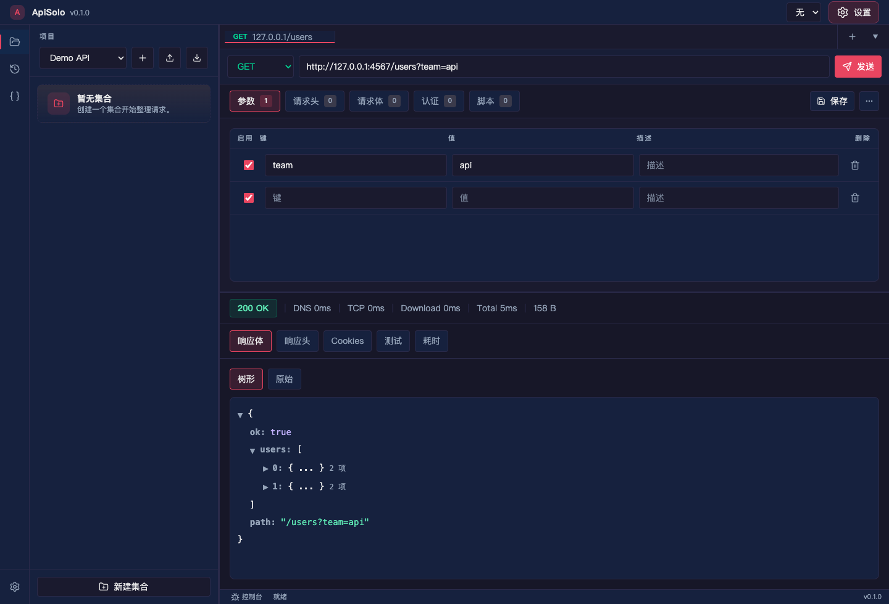
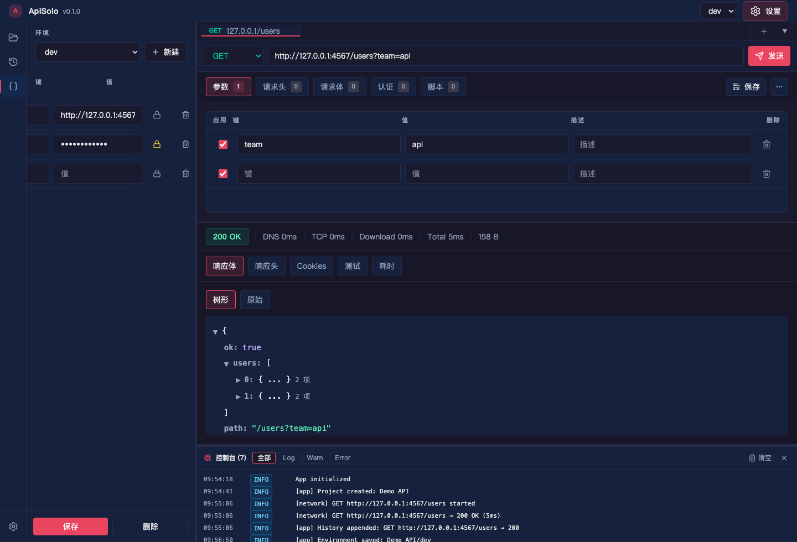
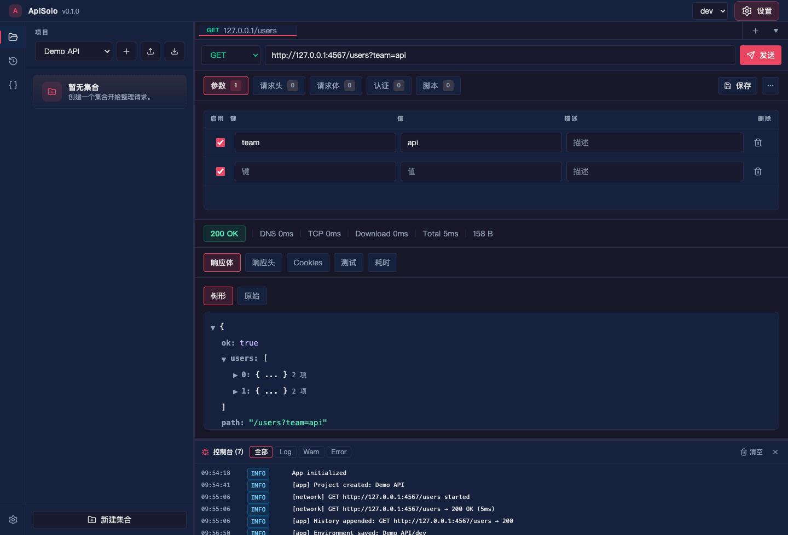
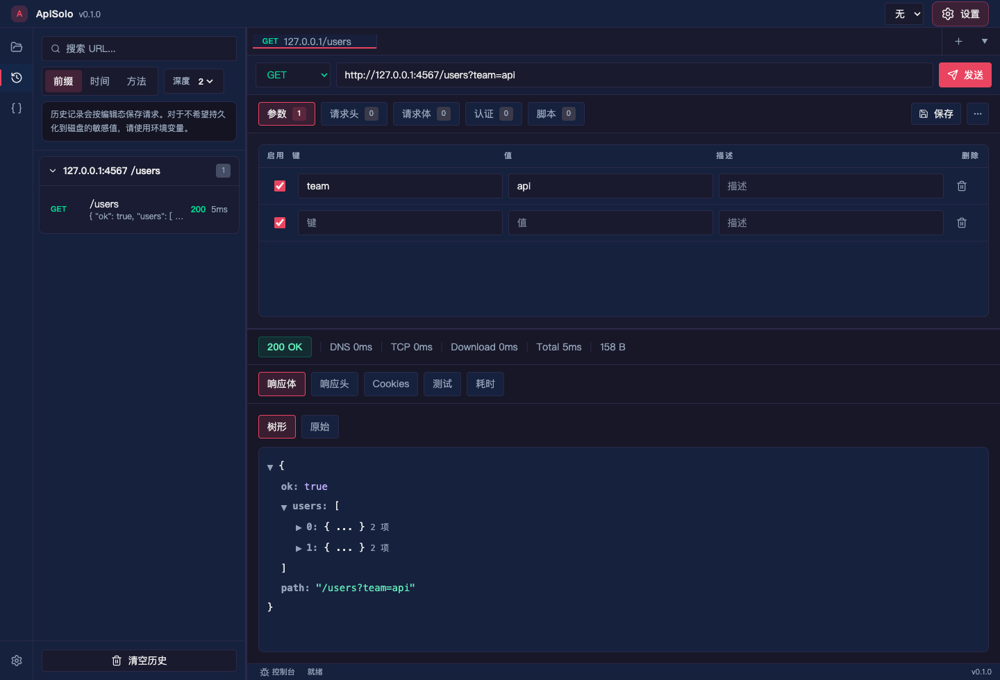
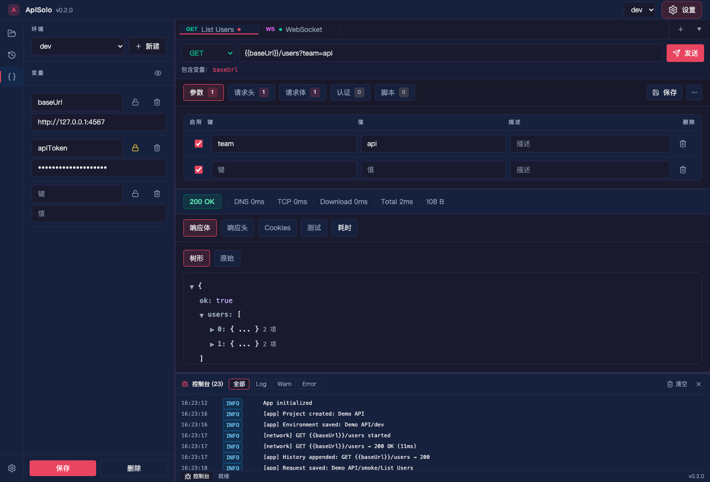
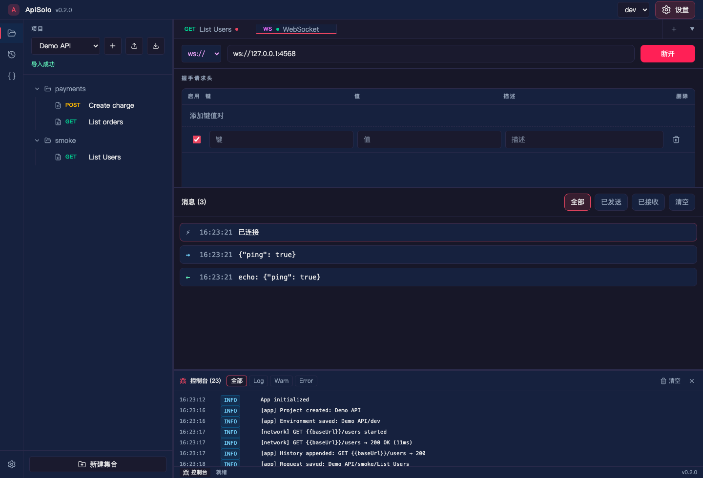
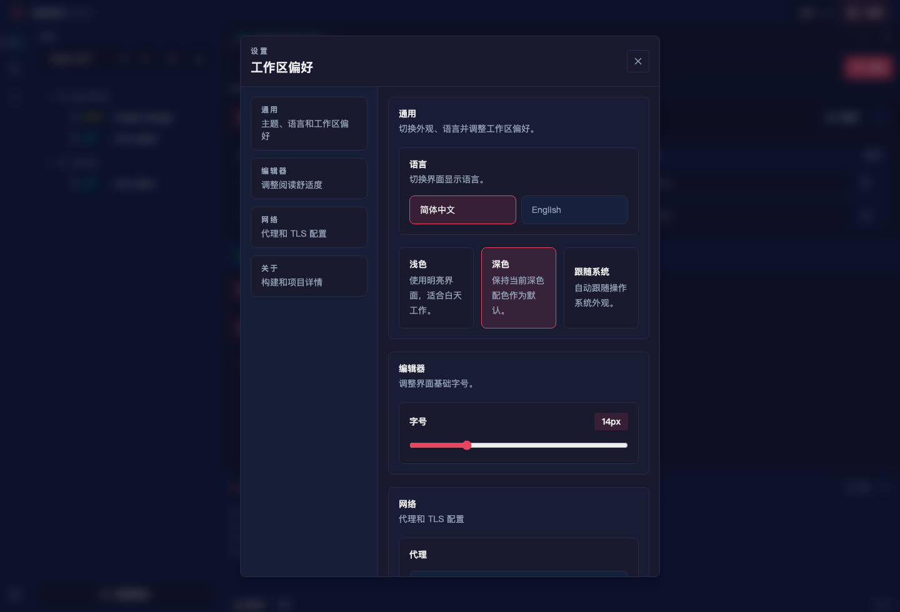

# ApiSolo

ApiSolo 是一个本地优先的桌面 API 客户端，基于 Tauri、Rust、Vue 和 Pinia 构建。它面向 HTTP 请求编排、WebSocket 调试、项目集合、环境变量、请求历史和内置控制台，不需要托管账号。

[English](./README.md)

## 截图

| HTTP 工作区 | JSON 响应树 |
| --- | --- |
|  |  |

| 集合与导入导出 | 历史分组 |
| --- | --- |
|  |  |

| 环境变量与密钥 | WebSocket 工作区 |
| --- | --- |
|  |  |

| 设置 | 调试控制台 |
| --- | --- |
|  |  |

## 功能

- HTTP 请求构建器：方法、URL 参数、请求头、请求体、认证辅助和响应耗时。
- JSON 树与原始响应视图，支持响应头、Cookies、测试和耗时明细。
- 项目集合：保存/读取请求，并提供兼容 Postman 的导入导出路径。
- 环境变量：普通值写入本地项目文件；密钥值默认写入本地加密 Vault，也可以显式选择系统钥匙串。
- Pre-request 和 test 脚本在 QuickJS WebAssembly 沙箱中执行，并带有超时限制。
- WebSocket 连接：握手请求头、收发消息记录和连接状态。以下是有意为之的产品边界：握手预算 30 秒，且在途握手可以随时取消；单个连接最多保留最近 500 条消息，并显式显示已丢弃的条数；单条消息最多保留 65536 个字符，被截断时带明确标记；不做自动重连；WebSocket 帧不写入请求历史。
- 请求历史：按 URL 前缀、时间或方法分组，保留可重放的历史条目。条目可以写备注、加星标，星标条目不参与自动淘汰；命中网络上限的响应会在列表里带「未收全」角标，而不是被悄悄截短。
- 从历史保存请求时，会在放行之前先列出那些已被脱敏的字段：每一项都标明来源（请求头、Query、表单、请求体、认证）；历史从未保存过字节的文件则单独列为「需要重新选择文件」。
- 二进制响应会以「这是什么」的说明呈现，而不是乱码或一串字面占位文本——收到时如此，从历史重新打开时同样如此。
- 内置调试控制台：记录应用、网络和脚本事件。
- 浅色/深色/跟随系统主题，英文/简体中文界面，代理和 TLS 设置。

## 界面导览

- 左侧导航：在集合、历史记录、环境变量之间切换。
- 顶部栏：选择当前环境并打开设置。
- 标签栏：同时保留多个 HTTP 和 WebSocket 标签页；通过 More 创建不同协议标签。
- 请求面板：发送前编辑 URL、参数、请求头、请求体、认证和脚本。
- 响应面板：查看状态码、耗时、响应体、响应头、Cookies、测试和耗时拆解。
- 底部控制台：查看请求生命周期、脚本输出、警告和错误。

## 核心流程

1. 在集合面板创建或选择项目。
2. 新建 HTTP 标签，输入 URL，配置参数/请求头/请求体/认证并发送。
3. 将常用请求保存到集合，需要时导出。
4. 创建环境，将稳定配置保存为普通变量，将 token、密码保存为密钥变量。
5. 在请求里使用 `{{baseUrl}}` 或 `{{apiToken}}` 这类占位符，避免硬编码敏感值。
6. 使用 WebSocket 标签调试本地或远程 socket。
7. 从历史记录查找之前的调用并按需回放。

## 安全与隐私模型

ApiSolo 只在本机保存数据，不依赖云账号。

- 数据目录：`$HOME/ApiSolo`。
- 项目目录：`$HOME/ApiSolo/projects/<project-slug>/`。
- 历史文件：`$HOME/ApiSolo/scratch/history.jsonl`。
- 窗口状态：`$HOME/ApiSolo/scratch/window-state.json` 保存主窗口上次尺寸，便于重启后恢复用户调整过的大小。
- 普通环境变量：项目内 `.env.json` 文件。
- 密钥环境变量：首次启动时 ApiSolo 会询问保存方式。默认使用本地加密 Vault，文件位于 `$HOME/ApiSolo/scratch/secrets.vault.json`；主密码只保存在当前内存会话中，应用重启后需要重新输入。可选的系统钥匙串模式通过 Rust `keyring` 写入操作系统凭据保险库，服务名为 `ApiSolo`，可能触发系统权限确认。
- 密钥存储配置：`$HOME/ApiSolo/scratch/secret-storage.json` 只保存选择的 backend，不保存密钥值或本地 Vault 主密码。
- 密钥元数据：`.env.secrets.json` 只保存变量名和 vault 引用；密钥值会写成空字符串。
- 迁移：如果旧版 `.env.secrets.json` 里有明文密钥，ApiSolo 首次加载时会导入当前选择的密钥 backend，并重写元数据文件去掉明文。
- 历史隔离行：`$HOME/ApiSolo/scratch/history.corrupt.jsonl` 原样保存解析不了的行（字节不改），这样一行坏数据只连累它自己，不会让整个历史面板变砖。「清空历史」会连同 `history.jsonl` 一起删除这个文件，且不可撤销。
- 收藏（星标）的历史条目不参与自动淘汰，因此历史文件可以无上限增长；增长多少完全由你收藏了多少条决定。收藏只豁免自动淘汰，不豁免显式清空——「清空历史」删除全部条目，收藏的也一起删。
- 从历史保存到集合的请求，其脱敏字段保存为空值，且不携带任何标记。之后从集合里打开这个请求不会出现「待重填」提示条：那些空字段看起来和你自己留空的字段完全一样。
- 从历史保存不是无损的。历史不保存上传文件的字节与路径（只留一个裸文件名），发送时被禁用的参数与请求头整行不写进历史。保存对话框能提示你重新选择哪些文件；它没法提到那些被禁用的行，因为它们根本不在这条历史里，界面上没有任何东西可以指着说这里少了点什么。
- 密钥库维护文件：`$HOME/ApiSolo/scratch/vault-maintenance.json` 记录迁移时发现的标识碰撞，以及尚未删除完成的待清理条目。它只保存标识和失败分类——不含任何密钥值，也不含钥匙串或 Vault backend 返回的原始错误文本。
- 碰撞提示是全局的：无论当前激活哪个项目都列出全部记录，且只出现在环境面板里——切到集合或历史面板时它不在屏幕上。
- 「我已重填，不再提示」会从维护文件里删除那条碰撞记录，不可撤销，此后 ApiSolo 不会再提到这次碰撞。
- 被覆盖的密钥值在这次升级之前就已不在磁盘上，无法恢复；ApiSolo 不猜它是什么，也不会用空值顶替——必须手动重新填写。
- 环境名会按大小写、空格与标点归一化成一个文件名，两种写法可能落到同一个环境上；用一个会归一化到已有环境的名字新建时，保存会被拒绝，而那个未保存的名字不会留在列表里。
- 密钥标识：vault key 的格式是 `<项目>:<环境>:<base64url 变量名>`，项目名和环境名里的非 ASCII 字符原样保留，不再被折叠成下划线，因此 `生产` 和 `测试` 不会再共用同一个格子。
- 惰性迁移：旧标识下的条目在你下次打开那个环境时才迁移，不做启动时的批量转换。没打开过的环境继续用它原来的条目工作。
- 崩溃残留：写入被中断时，目标文件旁边可能留下隐藏的 `.<名字>.<uuid>.tmp`。没有任何功能会读取它们，也没有自动清理；你可以随时自行删除。
- 读不出的密钥元数据：解析失败的 `.env.secrets.json` 会被改名为 `<名字>.env.secrets.corrupt-<时间戳>.json`，字节原样保留，既不覆盖也不删除。保存和删除该环境时都是这样处理——这些字节是「该环境拥有哪些密钥库条目」的唯一记录。如果该文件名已被占用，会追加一个序号，而不是覆盖先前那份。改名之后 ApiSolo 不会再读这个文件，也不会替你修复它：恢复的前提是先把隔离副本的内容改成合法 JSON，然后才改回原文件名。内容没修好就直接改回去，只会把原来的故障原样搬回来——打开该环境仍然会大声报错，下一次保存又会把同一个文件重新隔离出去。
- 认证方式选择 API Key 且「添加到」为 Query 时，该键值只在**发送时**追加到查询串；出于密钥保护，URL 栏不显示它，以免密钥出现在你可能复制或截图的地址里。地址栏看不到它说明它被隐藏了，不是没生效。
- 保存请求和历史记录会保留 `{{token}}` 这类变量占位符，但会脱敏直接写入的认证/请求头密钥值，并在持久化前移除 `fileContent` / `binaryContent` 字节。
- 脱敏只按**字段名**判定；写在非敏感字段名下的凭据——包括普通请求头或参数的值——既不会被脱敏也不会被标记，按原样存盘。
- 从历史打开的请求，其被脱敏的值会还原成**空值并带标记**。这些值必须重新填写请求才会成功；占位符 `[redacted]` 绝不会被发送到网络上。
- 请求脚本仍可通过 `pm.environment.get` 读到**明文**密钥值。只有把整个值原样复制到新变量才会继承密钥标记；`token.slice(0, 10)` 这类派生副本不会。
- 升级后，集合请求中 `signature` / `credential` / `subscription-key` 这类字段会显示为空、需要重新填写。磁盘上的文件在你保存该请求之前不会被改动。
- 被脱敏的**非字符串** JSON 值（数字、布尔、null、对象、数组）从历史回放时会变成空字符串 `""`，类型发生了变化。
- UI 中选择的上传文件属于当前会话数据；保存和历史条目只保留脱敏后的文件标签/占位信息。
- 代理认证密码不会持久化到浏览器 localStorage。
- Pre-request 脚本失败时会中止请求，并在当前标签页和控制台显示错误。
- 脚本运行时：请求脚本在 QuickJS/WASM 中执行，只暴露有限 API（`pm`、`console`、断言、超时和变量更新）。不会暴露 `window`、Node API 或 Tauri API。

安全敏感设置：

- 关闭 TLS 证书校验只适合可信本地调试；它会允许中间人拦截。
- 代理设置会将流量转发到指定代理，可能暴露请求元数据和请求体。
- 导入集合可能包含不可信数据；启用脚本前请先审查脚本内容。

## 开发

前置要求：

- Node.js 22+
- Rust 1.88+ stable
- Tauri 2 所需平台依赖

涉及 Rust 的 npm 脚本（`dev`、`dev:web:api`、`test:rust`、`audit:cargo`、`tauri:build`）都会有意把 rustup 工具链前置到 `PATH`：否则包管理器装的、低于 `src-tauri/Cargo.toml` 中 `rust-version` 的 rustc 可能把它遮蔽掉。请通过 npm 跑这些命令，不要直接调 `cargo`。

命令：

```bash
npm install
npm run dev
npm run dev:web
npm run dev:web:client
npm run dev:web:api
```

开发模式：

- `npm run dev` 启动完整 Tauri 应用，并启用 `devtools` 和 `dev-bridge` feature。
- `npm run dev:web` 同时启动 Vite 和 Rust 开发桥接服务，用于浏览器内 UI 测试。
- `npm run dev:web:api` 只启动 Rust 开发桥接服务。
- 开发桥接服务只在 `dev-bridge` feature 下编译，并要求每次会话的 token 请求头。Release 构建不会编译或启动本地控制面。

## 测试

```bash
npm test
npm run build
npm run test:rust
npm run audit
npm run audit:cargo
```

测试覆盖 QuickJS 沙箱、脚本超时、pre-request 失败中止、vault 保存/读取/删除/迁移、历史脱敏、保存请求移除文件内容、HTTP 执行、历史重放响应处理、窗口状态持久化和开发桥接默认关闭。

`cargo audit` 可能报告来自 Tauri/GTK/rand 依赖链的已知 upstream warning。新的直接漏洞仍必须在发布前修复。

## 构建发布

```bash
npm run release:check
npm run tauri:build
```

Release 约束：

- 当前公开发布边界只覆盖 macOS。GitHub Actions 会在 `v*` tag 或手动触发时构建未签名的 macOS DMG/App artifact。
- Tauri devtools 只通过开发脚本显式启用的 `devtools` feature 打开。
- 开发桥接服务受 `dev-bridge` feature 保护，不属于默认 release 构建。
- `npm run tauri:build` 会设置 `CI=true`，避免 macOS 自动化环境在装饰 DMG 窗口时依赖 Finder。

## 大小上限

- 响应体的网络读取有一个写死、不可配置的上限：16 MiB。超过上限的正文在该处截断，并在响应面板与历史中显式标注「未收全」；剩余部分从未被接收，ApiSolo 也不会自动重取。没有完整下载的出口——需要完整正文时请用别的工具（例如 `curl -o`）。
- 网络上限（16 MiB）与解压上限（64 MiB）是两个不同的数，且网络上限更小：前者管从网络收进来多少，后者管压缩体在内存里放大到多少。
- 上传方向超限是报错，不是截断：ApiSolo 绝不发出一个被截断的请求体。单个 binary 请求体或 form-data 文件部件解码后最多 16 MiB，选文件时超限的文件会当场被拒绝。
- dev bridge 的入站请求体有一个显式上限（64 MiB），不再依赖 HTTP 库的默认值，因此 `dev:web` 与打包版对同一次上传给出相同结果。

## License

Apache-2.0。详见 [LICENSE](./LICENSE)。
